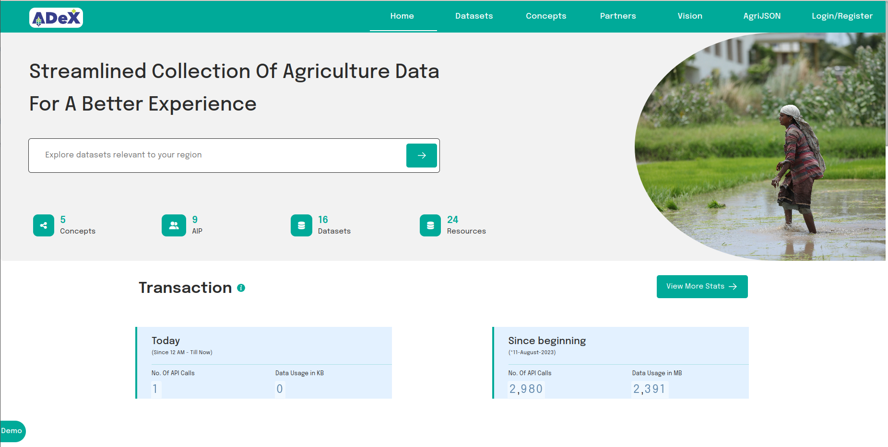
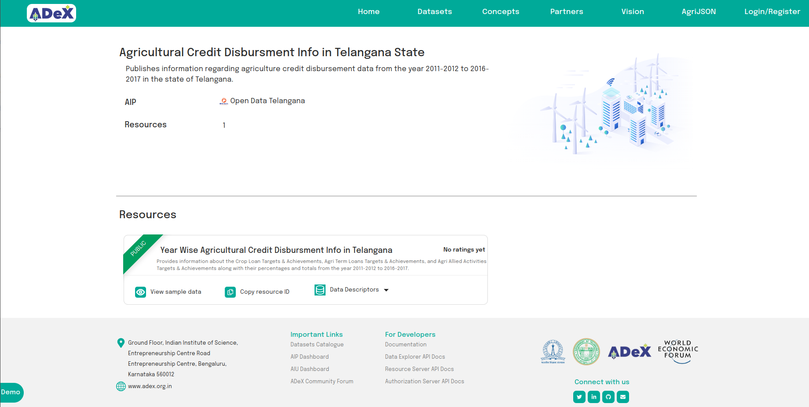

# Discover Resources

With the help of [Catalogue APIs](https://ts.adex.org.in/apis), an AIU can access information related to the availability of a resource using various APIs available.

## Using ADeX Catalogue UI

Users can also use the [Catalogue UI](https://dataexplorer.ts.adex.org.in/) to discover resources.

 
Fig:1 Catalogue UI

By using the search text box, users can perform a free text search. The UI will display a list of search results while typing a search query, which can be viewed by scrolling through them. If a user is interested in a resource, they can select it by clicking the respective resource in the list.

 
Fig:2 Catalogue Text Search

The Catalogue Resource Page provides information about a resource, including the resource ID, data descriptor, and other relevant details.

 
Fig:3 Catalogue Resource Page

## Access Policies of a Resource

A resource can be either _Public_, _Private_, or _Personal_. If a resource is Public, it can be accessed via APIs without any consent from an AIP. For Private resources, access to APIs is possible only with consent from the AIP. To access a Personal resource, an AIU must request a Data Sharing Agreement from the AIP, which is subject to approval.

By default, access to a resource via subscription and async APIs requires consent from the AIP.

## APIs Supported by a Resource

An AIU can use Catalogue Items [API](https://ts.adex.org.in/cat/apis#tag/Entity/operation/get%20item) to understand the resource. For example, in the [Year Wise Trend of Food Crops in Telangana State](https://dataexplorer.ts.adex.org.in/dataset/59c2af71-9661-4fac-94b3-45935781a7b6) resource, users can find information such as the data descriptor, sample data, resource ID, etc., which can be used to construct appropriate queries. The types of queries supported by a resource can be understood from [ADeX Resource APIs](https://rs.ts.adex.org.in/apis).

To access a resource, an AIU should [obtain an access token](./consumer_obtaining_access_token.md).