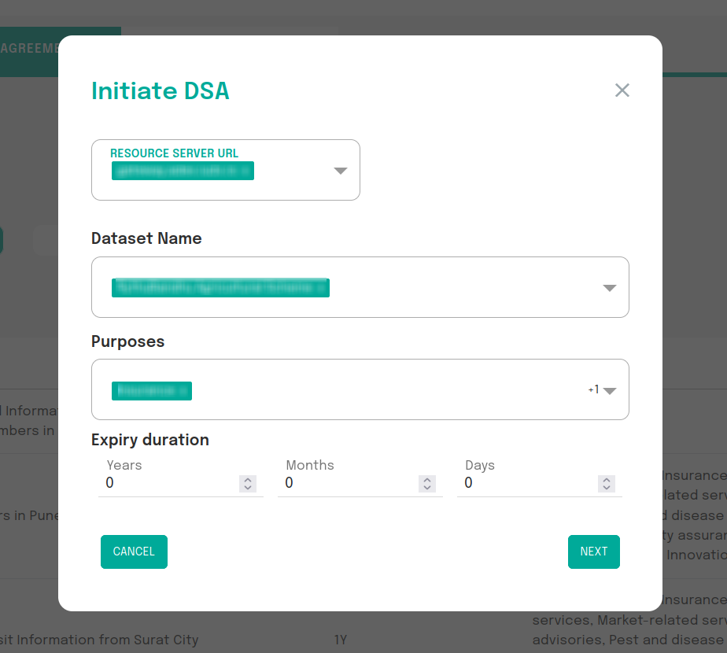

# Data Sharing Agreement
The data sharing agreement is a agreement between the AIP and AIU which determines the dataset/resource, list of purposes for data usage and how long the data can be accessed by the AIU.

AIUs may request for a DSA to a particular AIP as shown below.

 
Fig:1 DSA AIP Page

**NOTE: Data Sharing Agreement (DSA) is subject to approval by the AIP.**