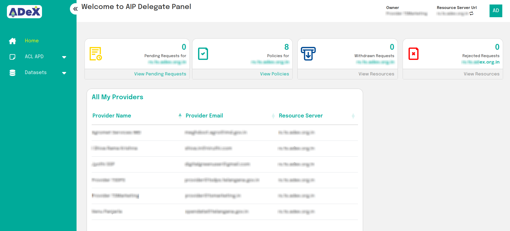

# Managing Policies and Delegations for different AIPs

In the Publisher Panel, an Auth-Delegate may view and switch between the AIPs who have granted them access. Once a AIP is chosen, the Delegate can view, create and delete both policies and delegations for said AIP.

 
Fig:1 View and change Providers

**NOTE: Auth-Delegates are not permitted to create other Auth-Delegates**

To manage policies and delegations, please see the associated sections in [Getting Started: AIP](../AIP/AIP.md).