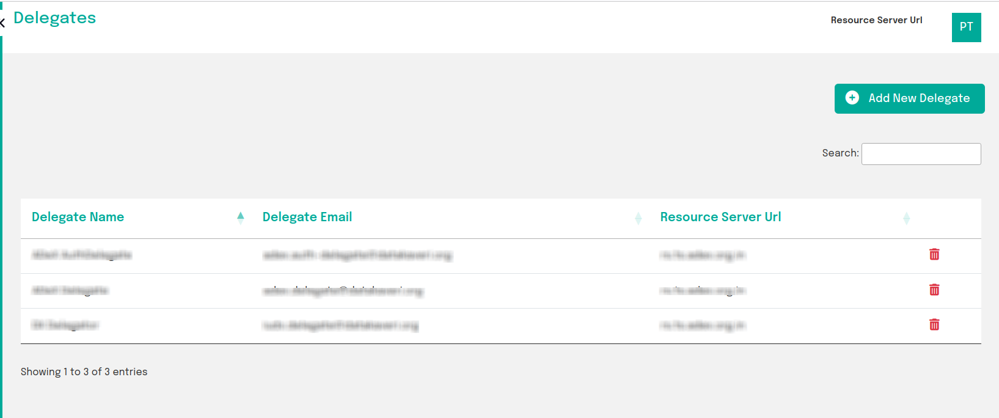

 
# Manage Delegations

AIPs can delegate administrative tasks to pre-approved users having the delegate role.
## Manage Delegates
A provider may view, create and delete delegations in the Delegates tab.

 
Fig:1 Viewing delegates

 
Fig:2 Add delegates