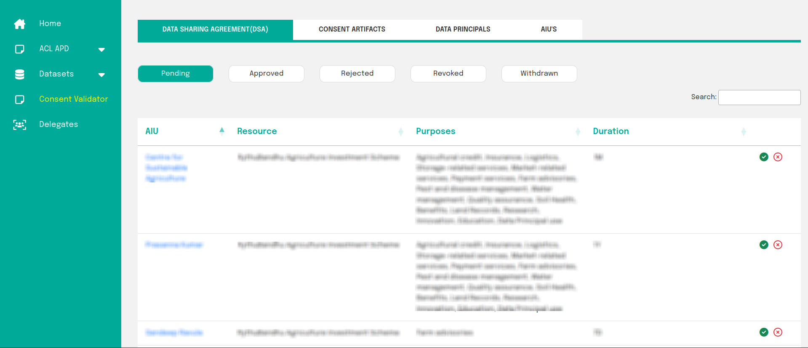

# Manage Data Sharing Agreement

The Data Sharing Agreement (DSA) is a formal agreement between the AIP and AIU. It specifies the dataset or resource being shared, the purposes for data usage, and the duration of access for the AIU.

AIPs have the authority to approve or reject DSA requests created by AIUs. Additionally, they can view the status of DSAs, including those that are revoked, withdrawn, approved, or rejected.

 
Fig:1 AIU DSA Page

Once a dsa is approved by clicking on the _GREEN_ button. An AIU will have access to the resource. However.... 