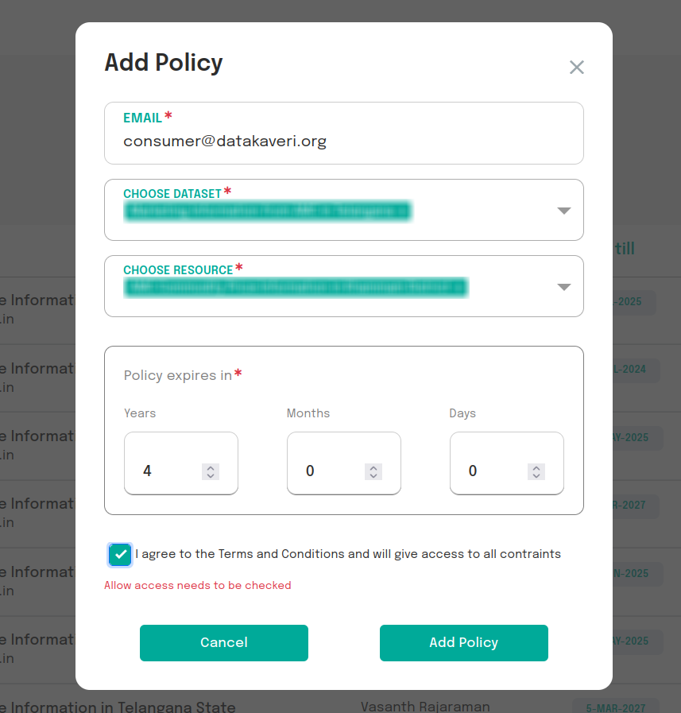

# Manage Policies

An AIP can create, view, and delete access policies set for AIUs and delegates in the AIUs tab.

Fig:1 View policies set for AIUs

A policy can be set for an AIU for a particular resource group or dataset with restrictions on access type.

- **API Access** allows the AIU to call the Resource Server APIs (latest, temporal, attribute, complex, etc.) on the resource group.
- **Subscription Access** allows the AIU to subscribe to the resource via RabbitMQ.

**The policy can only be created if the AIU exists and if the resource group or dataset exists in the ADeX Catalogue.** An expiry time for the policy can also be set. Once a policy expires, an AIU may not be able to request tokens for the particular resource.

Fig:2 Create policy

An AIP can also manage the policy requests generated by the AIU for a resource. They can approve or reject these requests.

Fig:3 Policy Requests