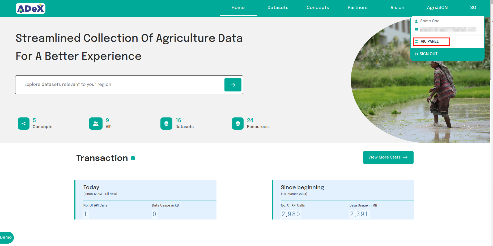
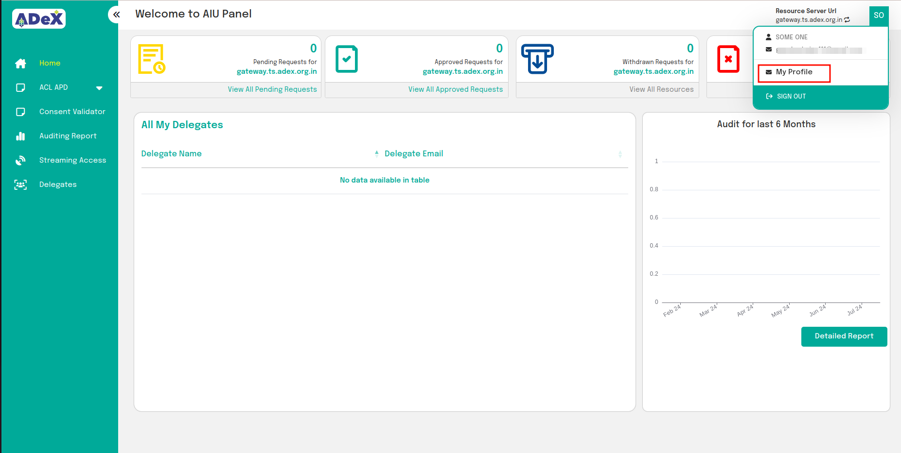
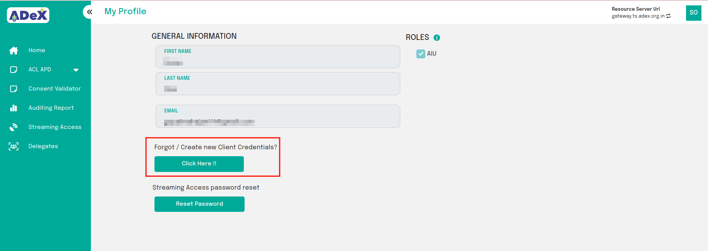
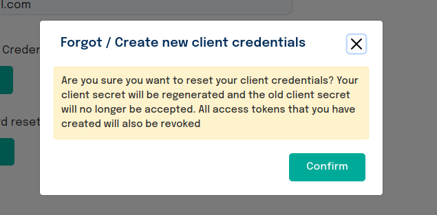
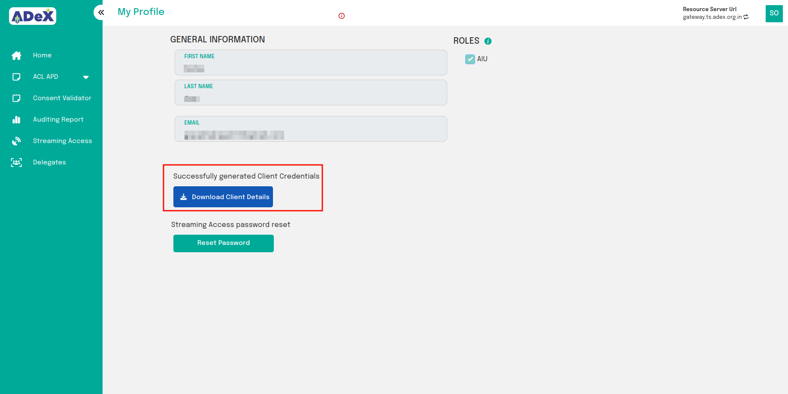

# Profile Management

Once users have registered as an AIU or been approved as an AIP, they can reset their default client credentials if they have lost  them.

1. Log into the catalogue panel and click on the top right button to enter the role panel.

 
Fig:1 Entering into the AIU panel

2. In the respective role panel, click on the top right button to enter the My Profile panel.

 
Fig:2 Entering into the My Profile panel

3. The My Profile panel allows users to download to reset their default client credentials in case they have lost them or if they have been compromised.

 
Fig:3 Getting default client credentials

**NOTE: Resetting client credentials will result in the revocation of all existing tokens. Additionally, the old client secret will not be accepted in token requests.**

 
Fig:4 Click confirm if you agree.

4. Once users confirm, credentials will be generated. Click the "Download" button to get a CSV file.

 
Fig 5: Downloading default client credentials