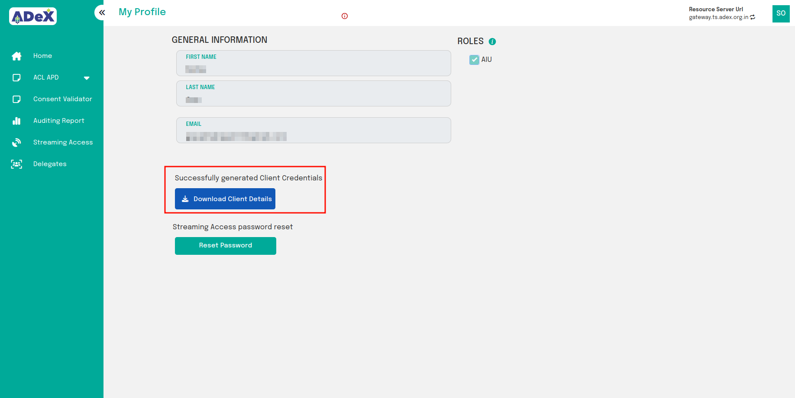

# Registration

## Introduction

All users of the ADeX platform must be registered and authenticated to perform any secure operation offered by the platform. The details of these secure operations are defined and explained by all ADeX components in their respective [API documentation](https://ts.adex.org.in/apis). The registration process of a user on the ADeX platform is a simple three-step process as outlined below:
1. [Creating the Account](#1-account-creation)
2. [Verifying the Email Address](#2-email-verification)
3. [Assigning / Requesting a User Role](#3-requesting-user-roles)

## 1. Account Creation

As the first step when a user accesses the [panel](https://dataexplorer.ts.adex.org.in), they need to register as a new user. Registering is highlighted in the picture.
 
Fig:1 Click on Register

 
Fig:2 Enter Account details

## 2. Email Verification

The user will receive an email with a verification link at their registered email address. By clicking this link, the user's account will be successfully connected to their email address.

***Note: The verification link will expire in 5 minutes.***

 
Fig:3 Sample email dialog

Once user's email address has been verified, they will be directed to an interface that looks like this:

 
Fig:4 Account created! The final registration step of selecting a role is pending.

## 3. Requesting User Roles

Once email verification is complete, the user can select their desired roles by clicking on the "Complete Profile" button on the subsequent interface. All roles are associated with a resource server to which the role applies. For example:

* Choosing the AIP (Agricultural Information Provider) role for the resource server "rs.example.com" allows the user to upload resources to the "rs.example.com" resource server and manage access to those resources.
* Choosing the AIU (Agricultural Information User) role for the resource server "rs.example.com" allows the user to request access to resources on "rs.example.com" and access permitted resources on that resource server.

**NOTE: If the user chooses the AIU role, all resource servers are automatically selected, and the user will receive the AIU role for any new resource server that is added.**

 
Fig:5 Choosing AIU role

After choosing the role as AIU and clicking Create Profile, a dialogue box with client credentials will appear. These credentials are required to obtain a token. User should click on "Download Credentials" to get the CSV file.

 
Fig:6 Click Download Credentials

This completes the registration process for AIU.

### AIP Registration

Users who need to take on the AIP role must provide their organization's details.

**Note: AIP registration is deemed complete only after the resource server admin approves it. Once approved, the AIP will gain access to the AIP panel. AIPs awaiting approval can contact ADeX to expedite the approval process.**

 
Fig:7 Choosing AIP role

 
Fig:8 Successful AIP registration (pending RS admin approval)
[//]: # (
)

[//]: # (Fig:8 Successful AIP registration &#40;pending RS admin approval&#41;
)
